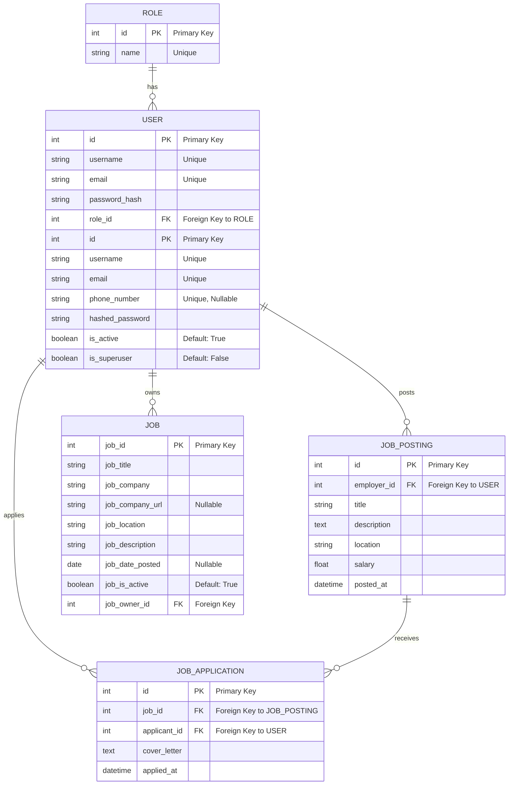
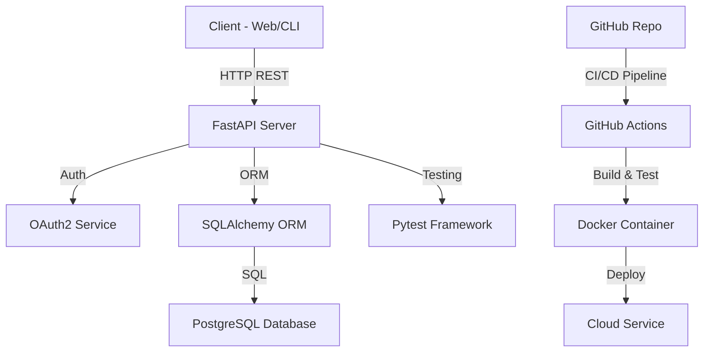
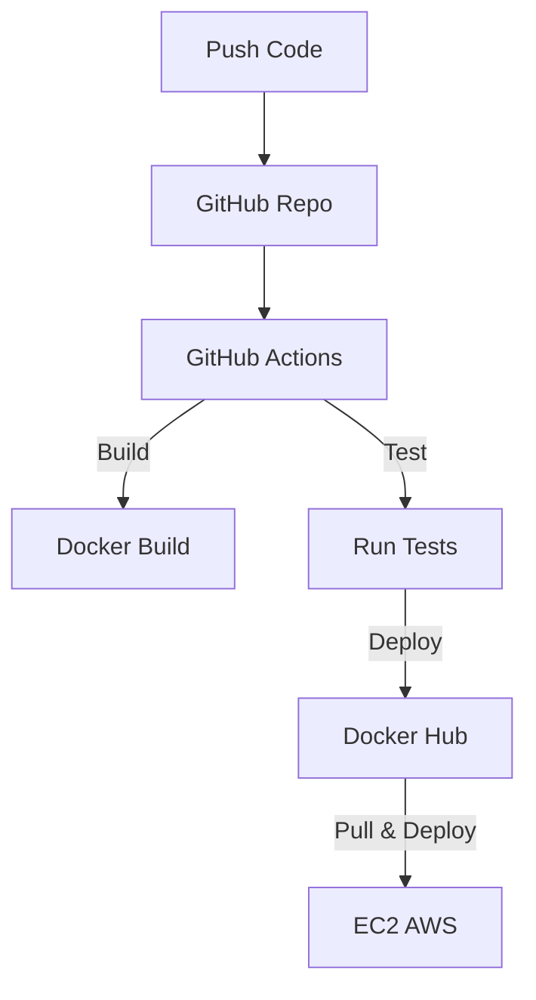

Creating a presentation for a job posting API using FastAPI for a Python FastAPI recruitment process involves outlining the project from features planning through to deployment. We'll use Markdown for the presentation format and Mermaid for diagrams.

### Job Posting API with FastAPI

#### Features Planning

1. **Overview**
   - Build a RESTful API for job posting operations.
   - Key features include user authentication, job postings management, application handling, and an admin dashboard.
   - Utilize Python, FastAPI, SQLAlchemy, and OAuth2 for authentication.

2. **Core Features**
   - **User Authentication**: Sign up, log in, and manage user sessions.
   - **Job Management**: Allow employers to post, update, and delete job listings.
   - **Application Management**: Enable job seekers to apply for jobs and track their applications.
   - **Search and Filtering**: Implement functionality to search and filter job postings.
   - **Admin Dashboard**: Manage users, postings, and applications through an admin interface.

3. **Technical Stack**
   - **Backend**: FastAPI for the web framework.
   - **Database**: PostgreSQL with SQLAlchemy as the ORM.
   - **Authentication**: OAuth2 with JWT tokens for secure authentication and authorization.
   - **Testing**: Pytest for unit and integration tests.
   - **Deployment**: Docker for containerization, GitHub for version control, and GitHub Actions for CI/CD.

#### Architecture Diagram

#### Implementation Highlights

1. **FastAPI Setup**
   - Create FastAPI project structure.
   - Define routes, models, and schemas for users, jobs, and applications.

2. **Database Models & Relationships**
   - Define `User`, `Job`, and `Application` models using SQLAlchemy.
   - Implement relationships: users to jobs (one-to-many), jobs to applications (one-to-many).

3. **Authentication & Authorization**
   - Set up OAuth2 with JWT for secure access.
   - Implement dependency injections for route protections.

4. **CRUD Operations**
   - Job postings: List, create, update, delete.
   - Applications: Apply to jobs, list applications per job, and per user.

5. **Search Functionality**
   - Implement query parameters for filtering job postings by keywords, location, and type.

6. **Testing**
   - Unit tests for model methods and utility functions.
   - Integration tests for API endpoints.

7. **CI/CD and Deployment**
   - Dockerize the FastAPI application.
   - Set up GitHub Actions for automated testing and deployment.
   - Deploy the Docker container to a cloud service.

#### CI/CD Flow Diagram

#### Conclusion

This project leverages FastAPI's efficiency and Python's power to create a robust, scalable job posting API. With comprehensive features from user management to job application processes, integrated authentication, thorough testing, and a streamlined CI/CD pipeline, this API is ready to power any job board platform.

Through this recruitment assignment, we demonstrated the capability to plan, implement, test, and deploy a sophisticated web API using modern development practices and tools.

new changes some other